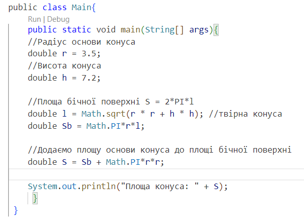

# Практика
____
### Завдання 1
Для першого завдання було створено папку Task01, в ній розміщено файл Main.java. В файлі створена проста консольна програма для обчислення Площі конуса.

Код програми:

Результат роботи програми:

