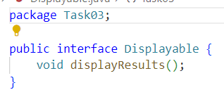

# Практика
____
### Завдання 1
Для першого завдання було створено папку Task01, в ній розміщено файл Main.java. В файлі створена проста консольна програма для обчислення Площі конуса.

Код програми:

Результат роботи програми:

____
### Завдання 2
Для другого завдання потрібно виконати три пункти.

#### 1.
Розробити клас, що серіалізується, для зберігання параметрів і результатів обчислень. Використовуючи агрегування, розробити клас для знаходження рішення задачі.

Для цього, я створила папку і файл Main.java

#### 2.
Розробити клас для демонстрації в діалоговому режимі збереження та відновлення стану об'єкта, використовуючи серіалізацію. Показати особливості використання transient полів.

Для цього було створено файл Calc.java

#### 3.
Розробити клас для тестування коректності результатів обчислень та серіалізації/десеріалізації.

Для цього пункту створено MainTest.java

Результат роботи програми:

____
### Завдання 2
Для третього завдання потрібно було виконати наступні пункти:

### Пункт 1.
Як основа використовувати вихідний текст проекту попередньої лабораторної роботи. Забезпечити розміщення результатів обчислень уколекції з можливістю збереження/відновлення.

Було створено папку Task03 та додано в неї файл Main. java. Забезпечено розміщення результатів обчислення та збереження/відновлення.

### Пункт 2.
Використовуючи шаблон проектування Factory Method (Virtual Constructor), розробити ієрархію, що передбачає розширення рахунок додавання нових відображуваних класів.

Було створено інтерфейс для фабричного методу (файл BodyFactory):

Створюємо конкретну реалізацію(файл ConBodyFact):

### Пункт 3.
Розширити ієрархію інтерфейсом "фабрикованих" об'єктів, що представляє набір методів для відображення результатів обчислень.

Створено інтерфейс (файл Displayable):

Реалізація інтерфейсу:

### Пункт 4.
Реалізувати ці методи виведення результатів у текстовому виде.

Створено метод toString():

### Пункт 5.
Розробити тареалізувати інтерфейс для "фабрикуючого" методу.

Створено інтерфейс BodyFactory.java

Цей інтерфейс приймає параметри і повертає об'єкт типу Main.

### РЕЗУЛЬТАТ
