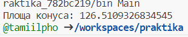

# Практика
____
### Завдання 1
Для першого завдання було створено папку Task01, в ній розміщено файл Main.java. В файлі створена проста консольна програма для обчислення Площі конуса.

Код програми:

Результат роботи програми:

____
### Завдання 2.         ВАРІАНТ №17

Визначити 8-річне та 16-річне уявлення цілісного значення загального електричного опору трьох послідовно з'єднаних провідників при заданому постійному струмі та відомій напрузі на кожному провіднику.

Для другого завдання потрібно виконати три пункти.

#### 1.
Розробити клас, що серіалізується, для зберігання параметрів і результатів обчислень. Використовуючи агрегування, розробити клас для знаходження рішення задачі.

Для цього, я створила папку і файл Main.java

#### 2.
Розробити клас для демонстрації в діалоговому режимі збереження та відновлення стану об'єкта, використовуючи серіалізацію. Показати особливості використання transient полів.

Для цього було створено файл Calc.java

#### 3.
Розробити клас для тестування коректності результатів обчислень та серіалізації/десеріалізації.

Для цього пункту створено MainTest.java

Результат роботи програми:

____
### Завдання 3

### Пункт 1.

Як основа використовувати вихідний текст проекту попередньої лабораторної роботи. Забезпечити розміщення результатів обчислень уколекції з можливістю збереження/відновлення.

Було створено папку Task03 та додано в неї файл Main. java. Забезпечено розміщення результатів обчислення та збереження/відновлення.

### Пункт 2.

Використовуючи шаблон проектування Factory Method (Virtual Constructor), розробити ієрархію, що передбачає розширення рахунок додавання нових відображуваних класів.

Було створено інтерфейс для фабричного методу (файл BodyFactory):

Створюємо конкретну реалізацію(файл ConBodyFact):

### Пункт 3.

Розширити ієрархію інтерфейсом "фабрикованих" об'єктів, що представляє набір методів для відображення результатів обчислень.

Створено інтерфейс (файл Displayable):

Реалізація інтерфейсу:

### Пункт 4.

Реалізувати ці методи виведення результатів у текстовому виде.

Створено метод toString(): 

### Пункт 5.

Розробити тареалізувати інтерфейс для "фабрикуючого" методу.

Створено інтерфейс BodyFactory.java

Цей інтерфейс приймає параметри і повертає об'єкт типу Main.

### РЕЗУЛЬТАТ.

____
### Завдання 4
Для цього завдання було п'ять пунктів:
1. За основу використовувати вихідний текст проекту попередньої лабораторної роботи Використовуючи шаблон проектування Factory Method
(Virtual Constructor), розширити ієрархію похідними класами, реалізують методи для подання результатів у вигляді текстової
таблиці. Параметри відображення таблиці мають визначатися користувачем.
2. Продемонструвати заміщення (перевизначення, overriding), поєднання (перевантаження, overloading), динамічне призначення методів
(Пізнє зв'язування, поліморфізм, dynamic method dispatch).
3. Забезпечити діалоговий інтерфейс із користувачем.
4. Розробити клас для тестування основної функціональності.
5. Використати коментарі для автоматичної генерації документації засобами javadoc.

__ВИКОНАННЯ ЗАВДАННЯ (bold)__

__Файл Main. (bold)__ Було створено папку Task04, та додано файл Main. Цей код реалізує простий текстовий інтерфейс для взаємодії з користувачем управлінням даними. Основна програма Main використовує клас ViewableResult, щоб отримати екземпляр інтерфейсу View, який визначає методи для перегляду, ініціалізації, збереження та відновлення даних.

__Файл ViewableTable. (bold)__ Було стврено файл ViewableTable. Клас ViewableTable представляє таблицю опору та реалізує методи інтерфейсу View, включаючи збереження і відновлення даних з файлу, а також відображення заголовка, тіла та підпису таблиці.

__Файл ViewTable. (bold)__ Було стврено файл ViewaTable. Цей код представляє клас ViewTable, який відповідає за відображення табличних даних про опір. Основні функції цього класу включають:

Встановлення та отримання ширини таблиці.
Форматування та виведення заголовку таблиці з опорами (8-біт та 16-біт).
Форматування та виведення тіла таблиці зі значеннями опору.
Форматування та виведення роздільної лінії.
Ініціалізація та виведення таблиці.

__Файл Maintest. (bold)__ Цей код представляє простий інтерфейс командного рядка для взаємодії з користувачем. Він включає такі можливості:

Виведення меню з командами: перегляд, генерація випадкових значень, збереження та відновлення.
Обробка команд користувача через введення з клавіатури.
Виконання відповідних операцій згідно з обраними командами, таких як виведення поточних значень, генерація випадкових даних, збереження та відновлення попередніх значень.
Завершення програми при введенні команди "q"

__Результат роботи прогарми: (bold)__
